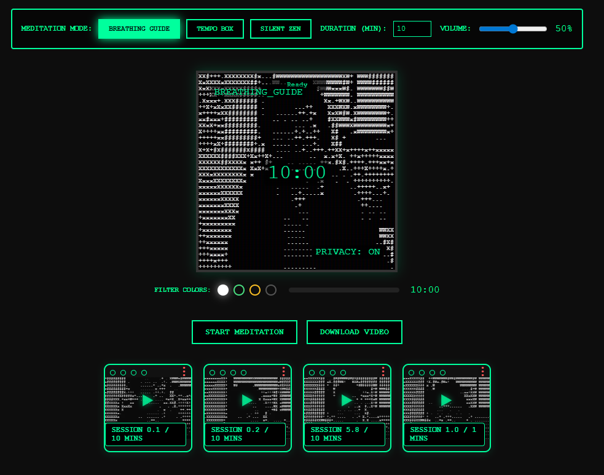

# 🧘 Cross Dot Meditation Art

A minimalist, privacy-first meditation web app featuring cross-dot ASCII video feedback and guided breathing exercises. Built with pure HTML, CSS, and JavaScript.


---

## 🚀 How To Run (Important)

Due to browser privacy security, **you must run this app via a local server** for the camera permissions and session history to save correctly. *Do not just double-click index.html.*

1. **Clone the repository:**
   ```bash
   git clone https://github.com/parkpoomdev/zelfzen.git
   cd zelfzen
   ```

2. **Serve it locally:**
   The easiest way is using `npx`:
   ```bash
   npx live-server .
   ```
   *(Alternatively, use Python: `python -m http.server 8000` or the VSCode "Live Server" extension).*

3. **Open in browser:**
   Navigate to `http://127.0.0.1:8080`.
4. **Grant camera permission** when prompted (Click the `[ CLICK TO START CAMERA ]` on the canvas).

---

## 🎯 Features

- **3 Meditation Modes**:
  - **Breathing Guide**: Follow an expanding/contracting circle for a gentle 8-second breathing pace.
  - **Tempo Box**: Track a pulsing square with quick 6-second cycles for focused rhythm.
  - **Silent Zen**: Pure meditation with no visual guides or audio cues.
- **Privacy First**: All processing is done completely offline in your browser. Nothing is sent to a server.
- **Cross Dot ASCII Art**: Adjustable cross/dot text-filtering with CRT scanlines and a switchable color palette.
- **Session History**: Easily export your sessions as sped-up WebM / GIF files, saved automatically to a local gallery grid.

---

## 📖 Quick User Guide

1. **Allow Camera**: On your first visit, click the canvas where it says `[ CLICK TO START CAMERA ]` to permit the browser video feed.
2. **Select Mode & Duration**: Use the top control panel to pick your guided style and adjust the meditation time (1-60 mins).
3. **Change Colors**: Click the four small dots in the top panel to swap between Classic, Matrix, Retro, and Invert themes.
4. **Meditate**: Click "Start Session". Once the timer ends, your session is automatically dumped into a sped-up "gif" loop in the gallery below.
5. **Download**: Click "Download Video" to save the recording directly to your device.

---

## 🔒 Privacy & Permissions
- ✅ **Camera Only** - No microphone requested.
- ✅ **Offline First** - Zero network requests made by the app.
- ✅ **Local Storage** - Your session history is securely saved to your browser's IndexedDB.

## 📄 License
MIT License - Free to use, modify, and distribute.

---

## 🖼️ New Meditation Grid UI



This is the new thumbnail for the meditation grid, as shown in the updated UI. The image demonstrates the layout with the filter color selector, timer bar, and session cards below the main video area.
